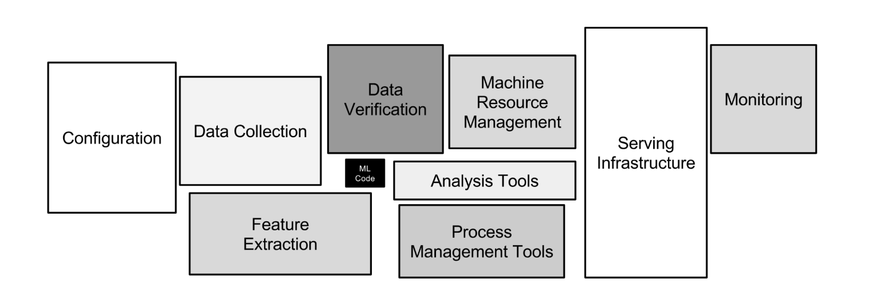
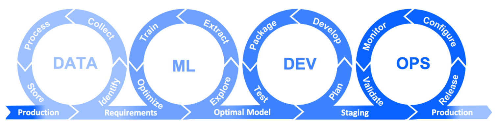

# Introduction to MLOps

## Motivations

MLOps (Machine Learning Operations) is a strategic approach to streamline and optimize (improving the efficiency interms of time and money and effectiveness in terms of target/goal) the machine learning lifecycle, addressing critical challenges in modern data science.
- A lot of MLOps skills implement good practice (versioning, testing…)
  - -> Increase the **quality** and the **reproducibility** of work
- **High in-demand skills!**
- To avoid the following situations:

## What does it do?

- Brings ML models to production
- Automates individual repetitive steps
- QC/QA
  - Quality Control :
    - Data quality (anomaly detection, data cleaning) and models quality (accuracy, performance evaluation)
    - Ensure that the input and output of the model respect the defined criterias such as :
        - Checking that model preditctions are correct (eg: try to predict price of house on the market)
        - Verifying that the model respect performance metrics before deploying it into production
        - Checking that it is encoded if it is necessary to be encoded (eg: 0 and 1 instead of female and male)
  - Quality Assurance :
    - Global process to ensure that systems and models respect quality standards for each step
    - It includes integration tests, regression tests and performances validation of the model before to go in production

## Why is it important?

- **Only models in production bring added value to the business**
  - It is trained and retrained with business data
  - It is applied on all the data of business to help you to take decisions
- Data Scientists are not final users so it is necessary to:
  - Ensure customer satisfaction by delivering continuously
  - Ensure the model match performance metrics
  - Ensure that the model match with user's business
- A lot of tasks are manual but repetitive (data ingestion, model re-training), which is waste of time
- Brings good practices to daily work

But...

- 80% of the models are never deployed
  - Complexity of the deployment 
  - Lack of mlops practices which is important to succeed and be able to maintain the model once deployed
  - Insufficient collaboration between IT team responsible for deployment and data scientists that develop models, for example: 
    - IT teams waiting for contenerized application while data scientists provides jupyter notebook
    - Python version used by data scientist is not the same as the one runing in production
    - Data scientists work with a simple data ingestion (reading a csv) while in production there is a streaming data ingestion pipeline with multiple data sources
  - Scalability issues : models working on small datasets may fail on large volume of data in production
  - Data quality and preparation challenges.
- Developing a model takes weeks/months, deploying takes months/year(s)

## Data science landscape

Data science is much more than just machine learning!

[Reference](https://proceedings.neurips.cc/paper/2015/file/86df7dcfd896fcaf2674f757a2463eba-Paper.pdf)

## ML in research vs. production

[Reference](https://www.youtube.com/watch?v=g08qBcdk3Ss)

Fairness in machine learning aims to correct and eliminate algorithmic biases related to race, ethnicity, gender, sexual orientation, disability and social class in models.

Interpretability in machine learning refers to how easily a human can understand and explain how a model arrives at its decisions or predictions.

## Challenges of deploying ML

[Reference](https://arxiv.org/pdf/2011.09926.pdf)

To deploy a machine learning model, a lot of challenging steps need to be achieved such as:
- Preparing your data
- Coding the machine learning model, taking into consideration all the infrastructure restrictions, and also taking into consideration the client infrastructure restrictions if it is supposed to run into the client's infrastructure, or device
- Ensuring that the model match the requirement encoding such as performance metrics and business driven metrics
- Deploying the model with all its challenges
- Focusing on cross'cutting aspects such as ethic, end users' trust and security

Software is being deployed all the time, so why is deploying ML models a particular challenge? 

To understand this, let’s look at an analogy in traditional software development: **DevOps**. DevOps aims to facilitate software deployment, but ML introduces additional complexities.

## DevOps Principles

- **It’s a culture**
- It encourages automation
- It strives to deliver the results quickly

- **Version Control**. Developers submit code changes to a central repository several times a day. Prior to submitting code to the master repository (master branch), all code must be verified. To facilitate collaboration, other developers can track changes.
- **Continuous Integration**. Members of the development team integrate their code in a shared repository, several times a day. Each developer segments the work into small, manageable chunks of code and detects potential merge conflicts and bugs quicker.
- **Continuous Delivery**. As the code is continuously integrated, it is also consistently delivered to the end-user. Smaller contributions allow faster update releases, which is a crucial factor for customer satisfaction.
- **Continuous Deployment**. A big part of DevOps is automating processes to speed up production. Continuous deployment involves automating releases of minor updates that do not pose a substantial threat to the existing architecture.
- **Continuous Testing**. Such a strategy involves testing as much as possible in every step of development. Automated tests give valuable feedback and a risk assessment of the process at hand.
- **Continuous Operations**. The DevOps team is always working on upgrading software with small but frequent releases. That is why DevOps requires constant monitoring of performance. Its main goal is to prevent downtime and availability issues during code release.
- **Collaboration**. One of the main goals of DevOps is to foster collaboration and feedback sharing. Development and Operations need to proactively communicate and share feedback to maintain an efficient DevOps pipeline.

## MLOps Principles

[MLOps lifecycle](https://www.iri.com/blog/test-data/test-data-for-devops-mlops-dataops/)

- Data
  - Identify data you need and the one you don't need
  - Collect needed data
  - Process the data (data transformation, standardisation)
  - Store your data (database, data warehouse, data lakehouse)
- ML 
  - Explore data to understand informations you can get
  - Extract : collect and prepare needed data necessary for the model
  - Train your model 
  - Optimize your model
- Dev
  - Plan
    - Ressources requirements
    - Allocate the time for the model development
    - Determine performances metrics to evaluate the model
  - Develop the machine learning code
  - Package
    - Create a package which will contain the code and the dependencies of the project
    - Structure the code to ensure that is is reusable and easy for anyone to contribute
    - Includes necessary metadata such as versions and dependencies*
  - Test the code
- OPS
  - Release your machine learning model
  - Configure the production infrastructure to be able to run the model
  - Monitor to ensure model performances
    - Track model performance metrics in real-time
    - Detect data drift and concept drift [Understanding Data Drift and Model Drift](https://www.datacamp.com/tutorial/understanding-data-drift-model-drift)
    - Monitor system health and resource utilization
  - Validate by:
    - Tests to validate the quality of model predictions
    - Comparing the model performances with performances requirements
    - Identifying if the model need to be retrained or updated

MLOps extends DevOps by adding complexities around models and data, requiring unique considerations for versioning, testing, and monitoring.

- Replace `code` in DevOps principles with `code + model + data` -> MLOps
- Some might be less impacted (CI/CD)
- Some heavily increase in complexity due to `model + data` part: versioning, testing, operations (performance monitoring)
- Additional one: **Model feedback**. Saving incoming data and predictions once a model is deployed.

## DevOps vs MLOps

- With DevOps, we deploy:
  - code (app)
- With MLOps, we deploy:
  - code (data pre-processing, feature engineering)
  - model
  - sometimes data (aggregates)
  - we actually deploy a **pipeline**

[Reference](https://www.youtube.com/watch?v=pqppGvTJm-A)

## Different tasks (and definitions) of MLOps

[Reference](https://www.youtube.com/watch?v=VCUDo9umKEQ)

## ML Lifecycle and Roles

## Tools

## Maturity levels of MLOps systems (according to Google)

[Continuous delivery and automation pipelines in machine learning](https://cloud.google.com/architecture/mlops-continuous-delivery-and-automation-pipelines-in-machine-learning)

Level 0: manual process

- Data scientists and Ops teams are **separated**
- Only **the model** is served (not the whole pipeline)
- Model is not frequently updated
- No monitoring

Level 1: ML pipeline automation

- The goal is CT in production when **new data** becomes available
- We need to deploy the **whole pipeline** (data+model)
- The steps need to be automated and orchestrated
- Code is reproducible and modular

Need of additional components:

- Triggers - to trigger the re-training
- Feature store - stores pre-computed features that model uses during serving
- Metadata store - execution logs

Level 2: CI/CD pipeline automation

- Automatically build, test, and deploy the new pipeline components to the target environment
- Deployment:
  - Automated - to the test environment
  - Semi-automated - to pre-production (triggered by merge)
  - Manual - to production

## Real life applications

- Depends a lot on the skills and experience of the group
- Depends a lot on the number of models to deploy/maintain
- Depends on how often we need to retrain the model

Generally:

- Starting with the simplest system
- Gradual improvements: automation of critical steps, adding tests, adding model monitoring...

---

*The content of this document, including all text, images, and associated materials, is the exclusive property of Adaltas and is protected by applicable copyright laws. Unauthorized distribution, reproduction, or sharing of this content, in whole or in part, is strictly prohibited without the express written consent of the author(s). Any violation of this restriction may result in legal action and the imposition of penalties as prescribed by law.*
