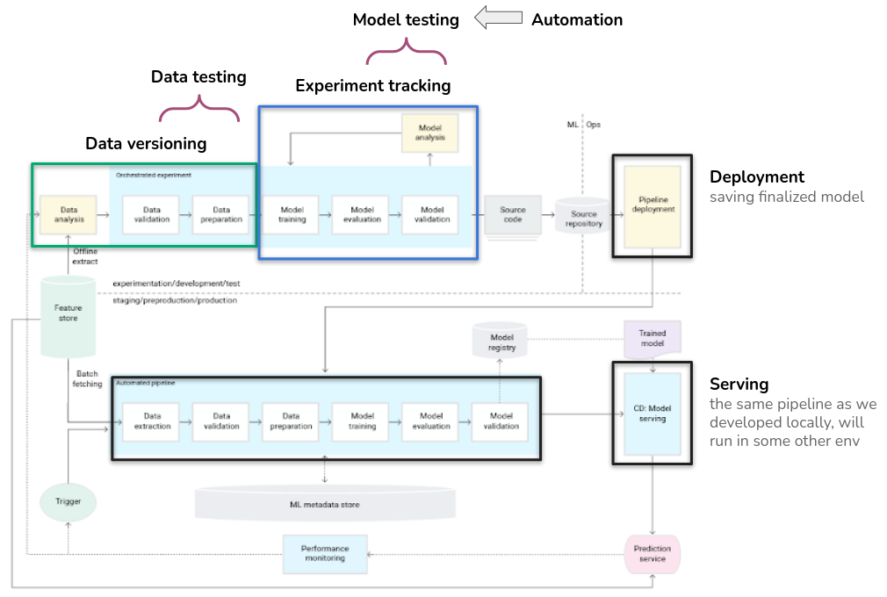
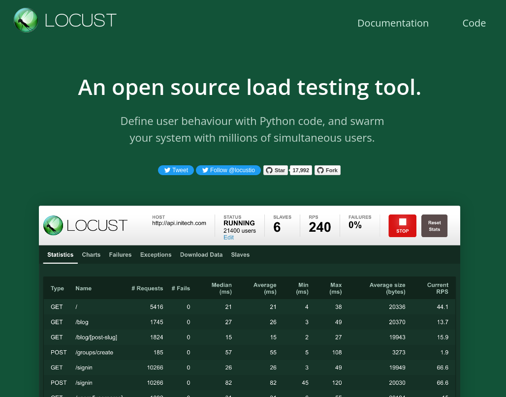

# Model deployment

## Motivations

- End-users can (finally) use it for inference
- We start generating value from all the hard work

## Roadmap

## Vocabulary

- **Delivery**: a step before deployment. The model is all ready, just waiting to be deployed.
- **Deployment**: integrating a new model into existing environment. It doesn’t need to be in interaction with end-users.
- **Serving**: a model put in disposition to end-users.
- **Release**: when we say a version of a service is released, we mean that it is responsible for serving production traffic. In verb form, releasing is the process of moving production traffic to the new version.

## Deployment targets

- Microservices with a REST API to serve online predictions.
- An embedded model to an edge or mobile device.
- Part of a batch prediction system.

## Latency constraints

- Batch predictions
- Real-time predictions

## Deployment strategies

[Reference](https://harness.io/blog/continuous-verification/blue-green-canary-deployment-strategies/)

## Tests after deployment

[Locust official site](https://locust.io/)

---

*The content of this document, including all text, images, and associated materials, is the exclusive property of Adaltas and is protected by applicable copyright laws. Unauthorized distribution, reproduction, or sharing of this content, in whole or in part, is strictly prohibited without the express written consent of the author(s). Any violation of this restriction may result in legal action and the imposition of penalties as prescribed by law.*
